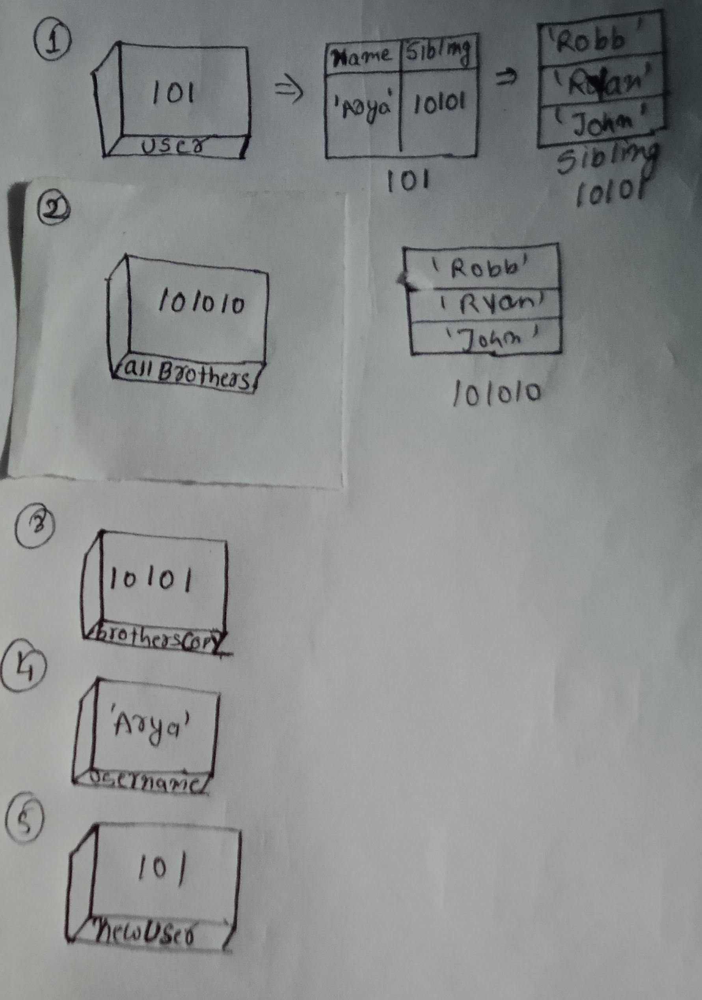

```js
let user = {
  name: 'Arya',
  sibling: ['Robb', 'Ryan', 'John'],
};
let allBrothers = ['Robb', 'Ryan', 'John'];
let brothersCopy = user.sibling;
let usename = user.name;
let newUser = user;
```

1. Memory representation

- Create the memory representation of the above snippet on notebook.
- Take a photo/screenshot and add it to the folder `code`

<!-- To add this image here use  -->

2. Answer the following with reason:

- `user == newUser;` // true . Store the same address
- `user === newUser;`// true .store same address 
- `user.name === newUser.name;`// true  .store same address and name are same data type
- `user.name == newUser.name;`// true .store same address and name are same 
- `user.sibling == newUser.sibling;`// true.store same address 
- `user.sibling === newUser.sibling;`// true .store same address and name are same data type
- `user.sibling == allBrothers;`//false .address are not same
- `user.sibling === allBrothers;`//false .address are not same
- `brothersCopy === allBrothers;`//false .address are not same
- `brothersCopy == allBrothers;`//false .address are not same
- `brothersCopy == user.sibling;`//true .store same address
- `brothersCopy === user.sibling;`//true .Store the same address
- `brothersCopy[0] === user.sibling[0];`//true Store the same address and value.
- `brothersCopy[1] === user.sibling[1];`//true Store the same address and value.
- `user.sibling[1] === newUser.sibling[1];`//true Store the same address and value.
